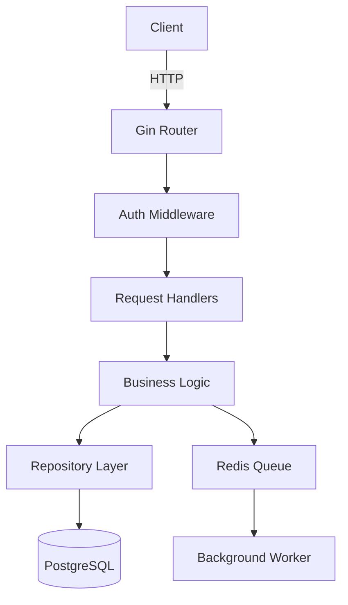

# Codebase Onboarding

## Summary

This skill transforms raw code into structured intelligence: architecture maps, entry points, data flows, security surfaces, and onboarding confidence scores.

**Domain**: knowledge

## Skill Identity

| Attribute | Value |
|-----------|-------|
| Domain | Knowledge Operations |
| Skill ID | codebase-onboarding |
| Version | 1.0.0 |
| Hacker Laws | Law 1 (Know Your Battlefield), Law 3 (Intelligence Over Force), Law 9 (Systematic Over Random) |
| Related Skills | knowledge-ops, deep-research, social-intelligence |

## Purpose

Rapidly acquire a mental model of any unfamiliar codebase — from a 500-line script to a 100M+ line monorepo. This skill transforms raw code into structured intelligence: architecture maps, entry points, data flows, security surfaces, and onboarding confidence scores.

In security contexts, codebase onboarding is the first step before code audits, vulnerability research, exploit development, and supply chain analysis.

## Scope Modes

Three modes based on what you need to know, not how much time you have:

| Mode | When to Use | Output |
|------|-------------|--------|
| **Targeted** | You know what you're looking for (e.g., "find all auth code") | Focused map of specific subsystem |
| **Exploratory** | You need to understand a feature area or module | Module-level architecture + data flows |
| **Comprehensive** | Full audit, exploit research, or security review | Complete intelligence package |

Choose mode before starting. Switching modes mid-session is allowed but requires re-baselining.

## Phase 0: Search-First (All Modes)

Before reading any code:

1. **Find existing documentation**
   - README, CONTRIBUTING, ARCHITECTURE, docs/, wiki/
   - OpenAPI/Swagger specs, Protobuf definitions
   - CI/CD config (reveals build structure and test commands)

2. **Identify the skeleton**
   - `package.json`, `go.mod`, `Cargo.toml`, `requirements.txt`, `pom.xml`, `build.gradle`
   - Entry points: `main()`, `app.py`, `index.js`, `server.go`
   - Config files: `.env.example`, `config/`, `settings.py`

3. **Detect framework signatures**
   - Import patterns, directory names, config file names
   - See Language Support section for framework detection by language

4. **Run static index** (Targeted/Comprehensive modes)
   - ctags, cscope, or language server for symbol maps
   - File tree with line counts: `find . -name "*.py" | xargs wc -l | sort -rn | head -50`

## Methodology

### Phase 1: Orientation

- Count files, LOC, and language distribution
- Identify primary language(s) and detect framework
- Map top-level directory structure to functional areas
- Find entry points and main execution paths

### Phase 2: Architecture Mapping

- Trace request/data flow from entry point to persistence
- Identify layers: API → Business Logic → Data Access → Storage
- Map inter-service dependencies (microservices) or module boundaries (monolith)
- Detect shared libraries, utilities, middleware

### Phase 3: Security Surface Analysis

- Authentication and authorization code locations
- Input validation and sanitization points
- External integrations (APIs, databases, message queues)
- Secret/credential handling
- Known dangerous patterns by language

### Phase 4: Deep Dive (Comprehensive mode only)

- Critical path tracing for key operations
- Data flow for sensitive operations (payments, auth, PII)
- Dependency vulnerability surface (outdated packages, CVE exposure)
- Test coverage gaps that indicate under-reviewed areas

### Phase 5: Knowledge Consolidation

- Generate structured output (see Output Format below)
- Record confidence scores per subsystem
- Identify gaps for follow-up research
- Hand off to knowledge-ops for persistence

## Language Support

### Tier 1 — Full Automation Support (75–90% automated)

| Language | Frameworks Detected | Entry Point Detection |
|----------|--------------------|-----------------------|
| Python | Django, Flask, FastAPI, Celery | `main.py`, `app.py`, `manage.py`, `wsgi.py` |
| JavaScript | Express, React, Next.js, NestJS | `index.js`, `server.js`, `app.js` |
| TypeScript | Same as JS + Angular | `main.ts`, `index.ts`, `server.ts` |
| Java | Spring Boot, Quarkus, Micronaut | `Application.java`, `Main.java`, `pom.xml` |
| Go | Gin, Echo, Chi, gRPC | `main.go`, `cmd/`, `internal/` |
| PHP | Laravel, Symfony, WordPress | `index.php`, `artisan`, `composer.json` |

### Tier 2 — Partial Automation Support (50–70% automated)

| Language | Notes |
|----------|-------|
| C / C++ | ctags/cscope required; complex build systems (CMake, Makefile) need manual interpretation |
| Rust | Cargo workspace support good; unsafe block detection is primary security focus |
| Ruby | Rails well-supported; Rack-based apps need manual routing trace |
| C# / .NET | Solution file parsing; dependency injection containers require manual tracing |

### Tier 3 — Manual-Heavy (20–40% automated)

Kotlin, Scala, Swift, Objective-C, Erlang, Elixir, Haskell, COBOL, and other languages require primarily manual analysis. Use Phase 0 docs-first approach and lean on test files for behavior discovery.

### 100M+ Line Strategy

For very large codebases (100M+ LOC):

1. **Index First**: Run ctags/cscope before reading any files
2. **Smart Sampling**: Focus on files with highest churn (git log), most imports, or security-critical paths
3. **Divide & Conquer**: Treat each top-level module as a separate Targeted-mode session
4. **Boundary Focus**: Understand module interfaces (APIs, contracts) before internals
5. **Avoid Full Reads**: Never attempt to read entire large files; sample entry, middle, and exit sections

## Output Format

### Confidence Score

Rate onboarding completeness per area:

| Score | Meaning |
|-------|---------|
| 0–20 | Uncharted — no meaningful understanding |
| 21–40 | Partial — know structure, not behavior |
| 41–60 | Functional — can navigate, some gaps |
| 61–80 | Solid — understand core flows and surfaces |
| 81–100 | Expert — deep understanding, audit-ready |

Report as: `Overall: 72/100 | Auth: 85 | Data Layer: 60 | API Surface: 78 | Internal Logic: 65`

### Structured Intelligence Package

```json
{
  "project": "target-name",
  "analyzed_at": "2026-05-11",
  "mode": "Comprehensive",
  "language_primary": "Go",
  "framework": "Gin + GORM",
  "loc_total": 85000,
  "confidence": {
    "overall": 72,
    "auth": 85,
    "data_layer": 60,
    "api_surface": 78,
    "internal_logic": 65
  },
  "entry_points": ["cmd/server/main.go", "cmd/worker/main.go"],
  "architecture": "Monolith with event-driven background workers",
  "security_surfaces": {
    "auth": "JWT via middleware/auth.go",
    "input_validation": "Partial — missing in admin routes",
    "secrets": "env vars via config/config.go",
    "dangerous_patterns": ["SQL concatenation in reports/query.go:145"]
  },
  "gaps": ["Payment flow not traced", "gRPC service definitions not reviewed"],
  "next_steps": ["Audit reports/query.go for SQLi", "Review payment/ module"]
}
```

### Architecture Diagram (Mermaid)



## Use Cases

1. **Pre-Audit Onboarding**: Map attack surface before security audit
2. **Exploit Research**: Locate vulnerable code patterns in target software
3. **Supply Chain Analysis**: Understand third-party library integration points
4. **Incident Response**: Rapidly understand compromised codebase structure
5. **CVE Reproduction**: Locate affected code for known vulnerabilities

## Hacker Laws Alignment

- **Law 1 (Know Your Battlefield)**: You cannot exploit what you don't understand
- **Law 3 (Intelligence Over Force)**: Systematic mapping beats random file reading
- **Law 9 (Systematic Over Random)**: Phase-based approach ensures nothing is missed

## Integration

- Feed output to **knowledge-ops** for cross-session persistence
- Use **deep-research** to research identified frameworks and known vulnerabilities
- Use **exa-search** to find CVEs for detected dependency versions
- Record security surfaces in mission memory before starting active testing
