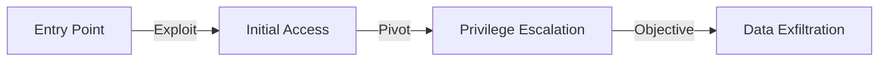

# Cross-Session Intelligence Aggregation Guide

Techniques for synthesizing intelligence across multiple sessions into coherent, actionable reports.

---

## The Cross-Session Problem

Single-session work produces isolated findings. Real intelligence comes from aggregating patterns, connections, and confidence evolution across weeks or months of work.

**Without aggregation**: 50 isolated findings across 10 sessions
**With aggregation**: 8 high-confidence attack paths + 3 recurring patterns + 2 critical vulnerabilities

---

## Aggregation Workflow

### Step 1: Session Inventory

```bash
# List all sessions for a target
ls memory/ | grep "target-org"

# Count sessions per target
ls memory/ | grep "target-org" | wc -l

# Session types
grep -l "type: entity\|type: finding\|type: relationship" memory/2026-*-target-org*.md | \
  xargs grep -h "source:" | awk '{print $2}' | sort | uniq -c
# Output: 5 osint, 3 codebase-onboarding, 2 deep-research
```

### Step 2: Entity Consolidation

```bash
# Extract all unique entities across sessions
grep -rn "type: entity" memory/*target-org*.md -A5 | \
  grep "Summary" | awk -F: '{print $3}' | sort -u > entities.txt

# Count entity types
grep -rn "type: entity" memory/*target-org*.md -A2 | \
  grep "tags:" | grep -oP "\b(domain|ip|person|system|credential)\b" | \
  sort | uniq -c
```

### Step 3: Finding Synthesis

```bash
# All findings for target
grep -rn "type: finding" memory/*target-org*.md -l | \
  xargs grep -h "Summary" | nl

# Group by severity (via tags)
grep -rn "tags:.*critical\|tags:.*high-risk" memory/*target-org*.md -l

# Group by vulnerability type
grep -rn "tags:" memory/*target-org*.md | \
  grep -oP "\b(sql-injection|xss|ssrf|idor|auth-bypass|jwt)\b" | \
  sort | uniq -c | sort -rn
```

### Step 4: Confidence Evolution Tracking

```bash
# Find all confidence history tables
grep -rn "## Confidence History" memory/*target-org*.md -A10 | \
  grep "| 20" | head -30

# Show confidence trends for a specific KU
grep -rn "KU-2026-05-002" memory/ -A15 | grep "| 20" | sort
# Example output:
# | 2026-05-11 | 40 | Static analysis
# | 2026-05-11 | 70 | Manual code review
# | 2026-05-11 | 88 | Active testing
# | 2026-05-11 | 98 | Exploitation
```

---

## Intelligence Report Templates

### Template 1: Target Profile

```markdown
# Intelligence Report: [Target Name]

**Generated**: [date]
**Sessions**: [count]
**Duration**: [first session date] to [latest session date]
**Total Knowledge Units**: [count]

## Executive Summary

[2-3 sentences: what we know, highest confidence findings, recommended actions]

## Entity Map

| Type | Count | Notable Entities |
|------|-------|-----------------|
| Domains | [count] | [key domains] |
| IPs | [count] | [key IPs] |
| People | [count] | [high-value individuals] |
| Systems | [count] | [critical systems] |
| Credentials | [count] | [exposed credentials] |

## High-Confidence Findings (>= 80)

| KU ID | Summary | Confidence | Type |
|-------|---------|-----------|------|
| [id] | [one-line summary] | [score] | [sql-injection/xss/etc] |

## Attack Paths

### Path 1: [Name]

1. **Entry**: [starting point, e.g., exposed subdomain]
2. **Exploit**: [vulnerability, e.g., SQL injection in search]
3. **Pivot**: [next step, e.g., extract admin credentials]
4. **Objective**: [final goal, e.g., RCE on production server]

**Confidence**: [overall path confidence]
**Estimated Difficulty**: [low/medium/high]
**KU Chain**: [KU-001] → [KU-002] → [KU-003]

## Recurring Patterns

| Pattern | Occurrences | Severity |
|---------|-------------|----------|
| [pattern name] | [count] | [critical/high/medium] |

## Open Hypotheses (Needs Validation)

| KU ID | Hypothesis | Confidence | Priority |
|-------|-----------|-----------|----------|
| [id] | [one-line summary] | [score] | [high/medium/low] |

## Intelligence Gaps

- [ ] [Subsystem not reviewed yet]
- [ ] [Missing information needed for complete picture]

## Recommended Next Steps

1. [Highest priority action]
2. [Second priority action]
3. [Third priority action]
```

### Template 2: Attack Chain Synthesis

```markdown
# Attack Chain Report: [Chain Name]

**Target**: [target]
**Path Confidence**: [aggregate confidence score]
**Estimated Time to Exploit**: [hours/days]
**Prerequisites**: [what the attacker needs]

## Chain Overview



## Step-by-Step Breakdown

### Step 1: [Entry Point]

**KU Reference**: [KU-ID]
**Finding**: [description]
**Confidence**: [score]
**Command**:
```bash
[exact command to reproduce]
```

**Evidence**:
[Screenshot, code snippet, or log output]

---

### Step 2: [Exploitation]

**KU Reference**: [KU-ID]
**Finding**: [description]
**Confidence**: [score]
**Command**:
```bash
[exact command]
```

---

[Continue for all steps]

## Risk Assessment

- **Impact**: [critical/high/medium/low]
- **Likelihood**: [very likely/likely/possible/unlikely]
- **Overall Risk**: [critical/high/medium/low]

## Remediation

1. [Primary fix]
2. [Secondary defense]
3. [Long-term improvement]
```

### Template 3: Pattern Intelligence Report

```markdown
# Pattern Intelligence: [Pattern Name]

**Pattern ID**: [KU-ID]
**Observed In**: [count] targets
**First Observed**: [date]
**Latest Observation**: [date]
**Confidence**: [score]

## Pattern Description

[What is the pattern? Why does it occur?]

## Affected Targets

| Target | KU ID | Confidence | Status |
|--------|-------|-----------|--------|
| [target-a] | [KU-ID] | [score] | [exploited/unconfirmed/patched] |
| [target-b] | [KU-ID] | [score] | [status] |

## Root Cause Analysis

**Why does this pattern recur?**
[Framework defaults, tutorial code, copy-paste, etc.]

**Indicators**:
- [File pattern, e.g., "jwt.sign with 'secret' fallback"]
- [Code pattern, e.g., "HS256 + environment variable"]

## Detection Command

```bash
[grep/find command to detect this pattern in new codebases]
```

## Exploitation Guide

[How to test for this pattern, how to exploit if found]

## Remediation Template

[Generic fix that works across all instances of this pattern]
```

---

## Cross-Session Query Patterns

### Query 1: Find All Related Knowledge Units

```bash
# Given a starting KU, find all linked units recursively
function find_related() {
  local ku_id=$1
  local depth=${2:-3}  # default depth 3
  
  echo "=== $ku_id ==="
  grep -rn "linked:.*$ku_id\|id: $ku_id" memory/ -l | \
    xargs grep -h "id:\|linked:" | grep -v "^--$"
  
  if [ $depth -gt 0 ]; then
    # Recursively find linked KUs
    linked=$(grep -rn "id: $ku_id" memory/ -A10 | grep "linked:" | \
      grep -oP "KU-\d{4}-\d{2}-\d{3}" | sort -u)
    for next_ku in $linked; do
      find_related $next_ku $((depth - 1))
    done
  fi
}

find_related "KU-2026-05-001" 2
```

### Query 2: Confidence Trend Analysis

```bash
# Show confidence evolution for all findings over time
grep -rn "## Confidence History" memory/ -A20 | \
  grep "| 20" | awk -F'|' '{print $2, $3, $4}' | \
  sort | head -50
# Format: | date | score | reason |
```

### Query 3: Cross-Target Pattern Detection

```bash
# Find findings with same tags across different targets
for tag in sql-injection jwt xss idor; do
  echo "=== Pattern: $tag ==="
  grep -rn "tags:.*$tag" memory/ | awk -F: '{print $1}' | \
    xargs grep -h "target:" | awk '{print $2}' | sort -u
done
```

---

## Aggregation Triggers

When to create an aggregated intelligence report:

1. **Session count >= 5** for a target — enough data for synthesis
2. **Multiple high-confidence findings** — attack path likely viable
3. **Pattern detected >= 2 times** — create pattern intelligence
4. **Before engagement handoff** — transferring to another team
5. **Before pentest report** — final consolidation for client deliverable

---

## Automation Helpers

### Script: Generate Target Summary

```bash
#!/bin/bash
# Usage: ./summarize_target.sh target-org

TARGET=$1
echo "# Intelligence Summary: $TARGET"
echo ""
echo "**Generated**: $(date +%Y-%m-%d)"
echo ""

echo "## Sessions"
ls memory/ | grep "$TARGET" | wc -l
echo ""

echo "## Entities"
grep -rn "type: entity" memory/*$TARGET*.md | wc -l
echo ""

echo "## Findings"
grep -rn "type: finding" memory/*$TARGET*.md | wc -l
echo ""

echo "## High-Confidence Findings (>= 80)"
grep -rn "confidence: [89][0-9]\|confidence: 100" memory/*$TARGET*.md | \
  grep -v "history\|Reason" | wc -l
echo ""

echo "## Open Hypotheses"
grep -rn "type: hypothesis" memory/*$TARGET*.md | wc -l
```

### Script: Extract Attack Chain

```bash
#!/bin/bash
# Usage: ./extract_chain.sh KU-start-id

START_KU=$1
echo "# Attack Chain Starting from $START_KU"
echo ""

# Find starting KU
grep -rn "id: $START_KU" memory/ -A15 | head -20
echo ""

# Find all linked KUs
echo "## Linked Units"
grep -rn "id: $START_KU" memory/ -A10 | grep "linked:" | \
  grep -oP "KU-\d{4}-\d{2}-\d{3}" | while read ku; do
  echo "### $ku"
  grep -rn "id: $ku" memory/ -A5 | grep "Summary" | awk -F: '{print $3}'
done
```
